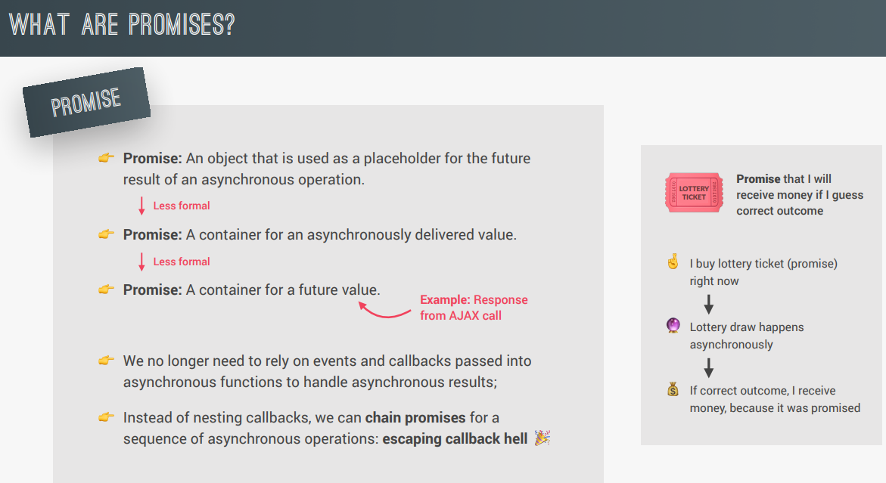

### AJAX

Asynchronous Javascript And XML. In practice, XML is not used anymore and json is the most popular data format.

      const request = new XMLHttpRequest();
      request.open('GET', ${requestUrl});
      request.send();

      request.addEventListener('load', callback_funtion)

### Promises & Fetch API

- Fetch: most modern way to interact with a web API using AJAX; gets our data and returns a promise, we simply consume it.
  It does not reject 403/404 errors, we need to manually handle such errors by checking (!res.ok)

- JSON is just like a JS object but it's always a 'sinlge string'.

- CORS: Cross-Origin-Resource-Sharing.
  Same origin policy of JS, allows to send AJAX request on same domain only, not to other domains. Developers of the API need to implement CORS on their own server. (A hack: Developers requesting the data from an API proxy/channel the request to their own server and then send the data to the browser. We used a service to do exactly that for us!)

- .json() method also works in the background(asynchronously) as it can time to parse the json data into JS readable format. Hence, it also returns a promise.

      // a promise is returned here
      const request = fetch(${requestUrl}).
                          then(response => response.json()).
                          then(callback_function)

- Errors can be caught/handled at the last, while chaining promises, as errors travel down till they are not caught.
- Both the methods, _.then_ and _.catch_ also return a promise
- 'catch' can't throw 404 errors

### Promise Combinators

- _Promise.all([])_: takes an array of calls(promises) to run in parallel and returns an array
- _Promise.race([])_: takes an array of promises but return only 1 of them, the one which resolves fastest.

PS: in above combinators, if any one promise rejects, entire chain breaks and reject is returned. These return the values of promises.

- _Promise.allSettled([]): returns the result of all promises, even if any of them rejected_
- _Promise.any([])_: returns the first fulfilled promise and ignores all the rejected ones
