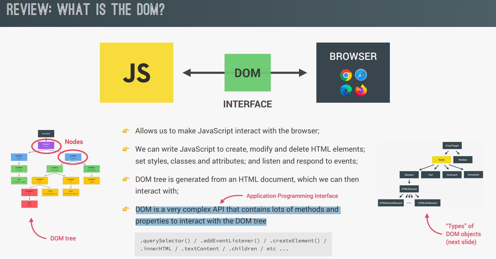
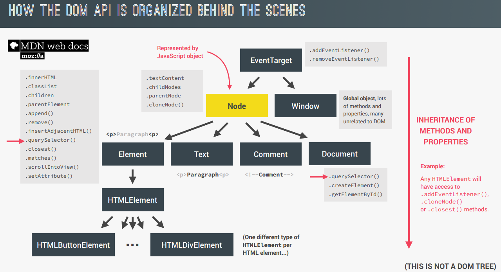
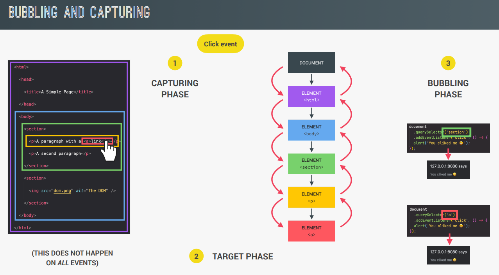
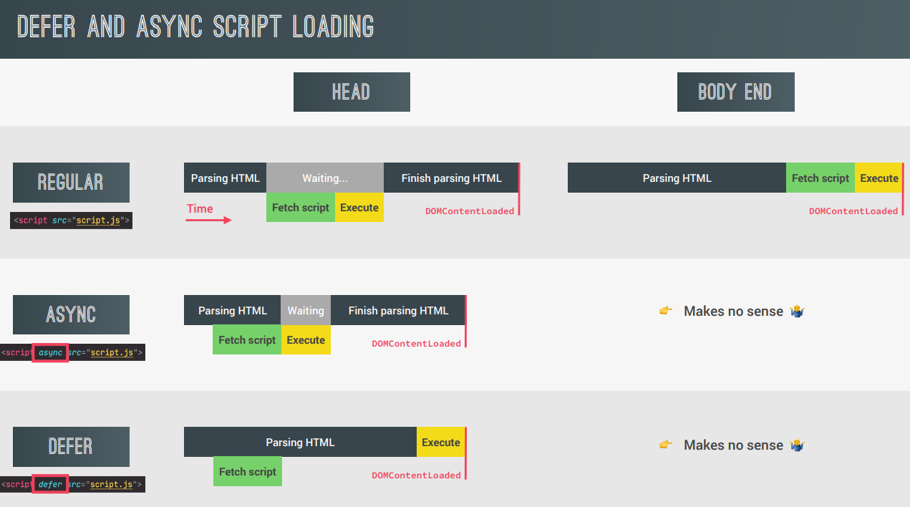
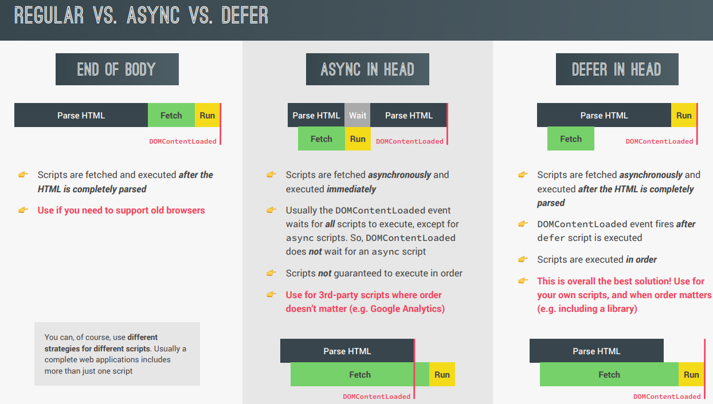

### What is a DOM?

### What is event propogation & bubbling?

- We can stop the propogation to parent element using e.stopPropogation();
- e.currentTarget === this; // true
- We can also make the event move from top-bottom instead of bottom-top by adding 'true' as a parameter to addEventListener funtion

### Event Delegation

Example use case: Navbar page navigation / Tab component
Here, we add click event to parent(all navbar links). Then, as we click on child elements(nav links), the event is delegated by parent to the child

        document.querySelector('.nav-links').addEventListener(click, e => {
          e.preventDefault();

          if(e.target.classList.contains('nav-link')) {
            const id = e.target.getAttribute('href');
            document.querySelector(id).scrollIntoView({behavior: 'smooth'});
          }
        })

### Sticky navigation: scroll event vs intersection observer API?

- 'scroll' event is not good for performance and we should rather be using intersection api(helps in knowing when our target element intersects the viewport or another element)
- We can add the effect of revealing elements(sections/divs) on scroll using this intersection observer API only
- Similarly, imgs can be lazy-loaded as follows:
  1. In HTML, use src="minified-img" data-src="real-img"
  2. In CSS, add .lazy-img {filter: blur(10px)}
  3. In JS, use intersection observer to observe each img and run a callback fn which will change src to data-src & remove .lazy-loaded using 'load' eventListener

### Optimizing loading of script for better performance

best solution is to use scripts with 'defer' attribute inside head

