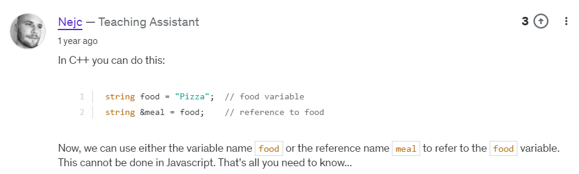
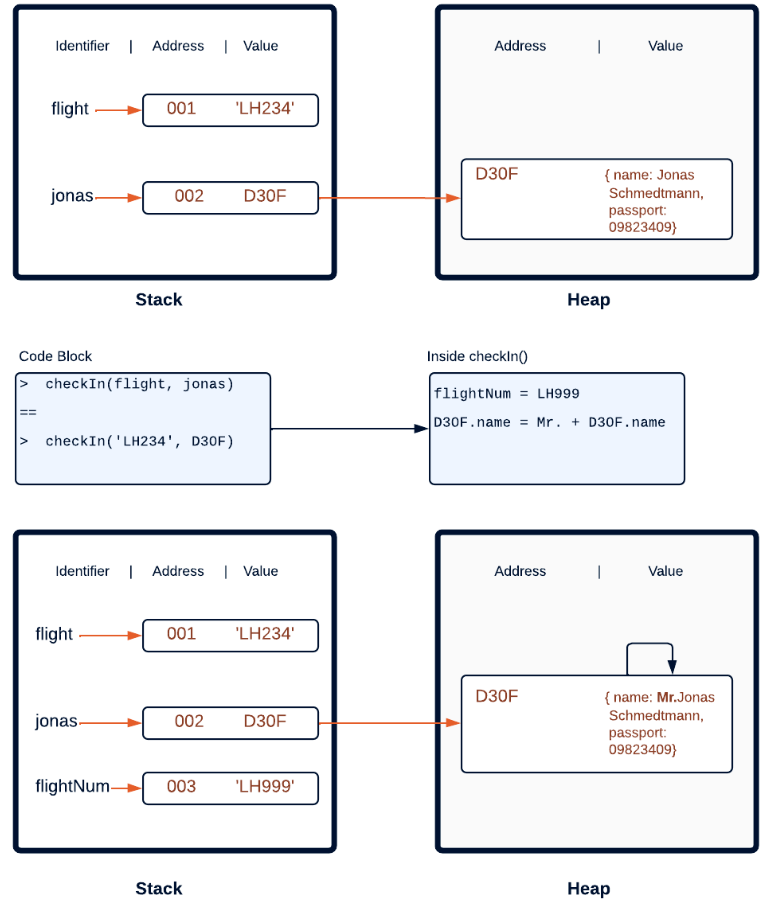
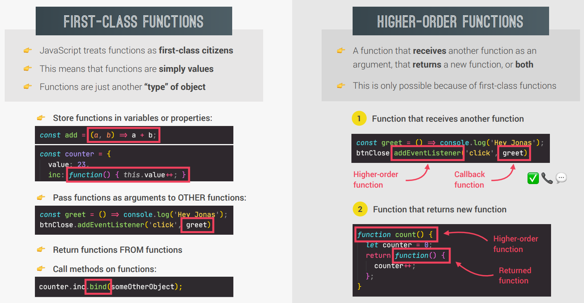
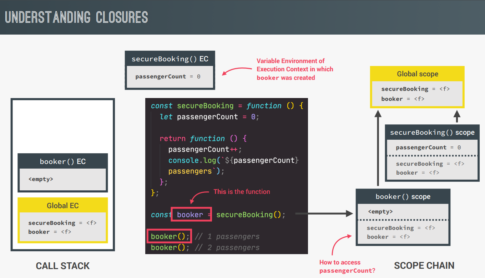
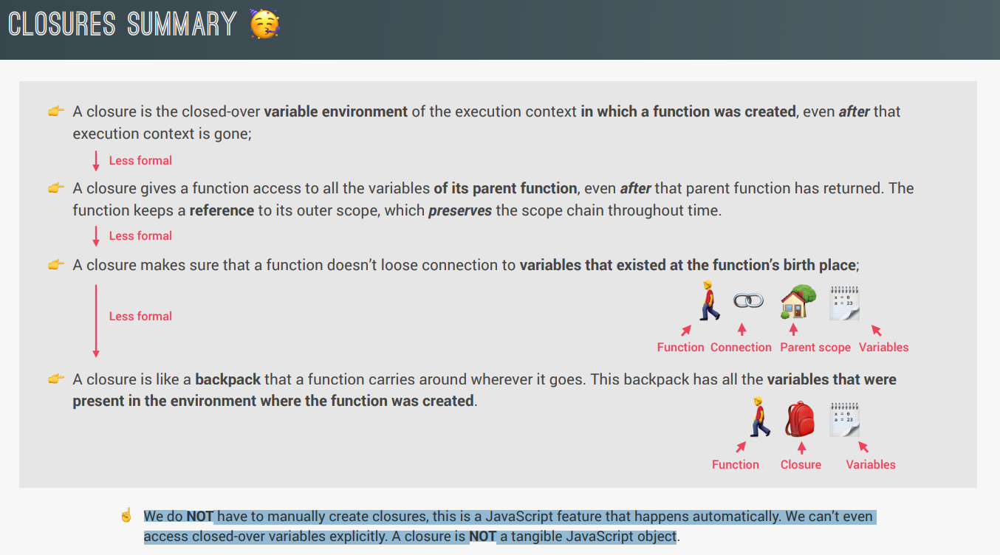
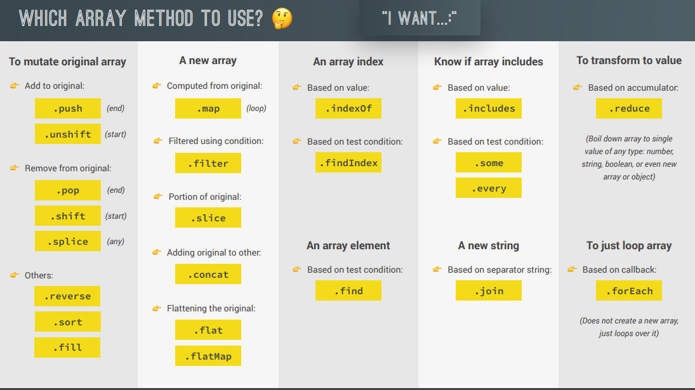

### Pass by reference like C++?

Technically, JS _does not_ have 'pass-by reference'(basically, no concept of pointers), like other languages.

When we pass a primitive type as an argument on a function, the function makes a copy of the original value, and works with it.
When we pass an object as an argument on a function, the function makes a copy of the reference that points to the place of the memory where the object is stored. This copy is a value itself, is not a reference. Through this value, the original object can be modified from inside of a function.

### First-class vs Higher-order functions

### call, apply, bind methods

all three methods are ways of setting the 'this' keyword on calling a function

Example:-

Here, 'book' is a fn present in some object other than 'swiss'. We want to call that same method on 'swiss' now.
We do this by attaching the 'this' keyword to swiss object here

      // array is needed in apply method
      const flightData = ['MH370', 'Mary James'];
      book.apply(swiss, flightData)

      // separate elements are needed in call method
      book.call(swiss, ...flightData);

      // we can call the fn normally with bind method
      const bookBind = book.bind(swiss);
      bookBind('MH370', 'Mary James')

### CLOSURES

We can have a look (not access) inside this bagpack by doing _*console.dir(booker);*_

### Arrays

