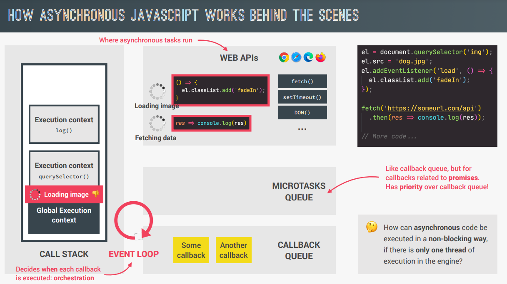
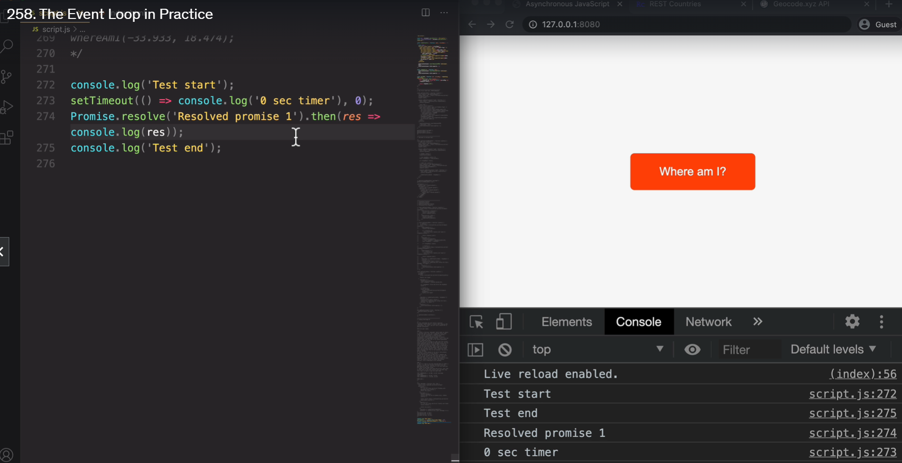
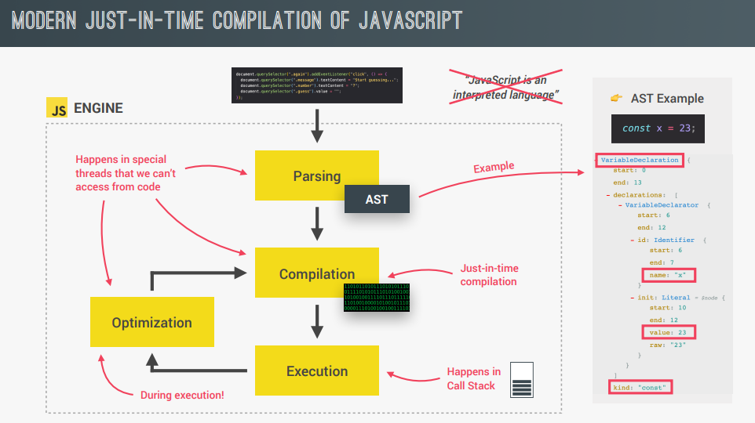
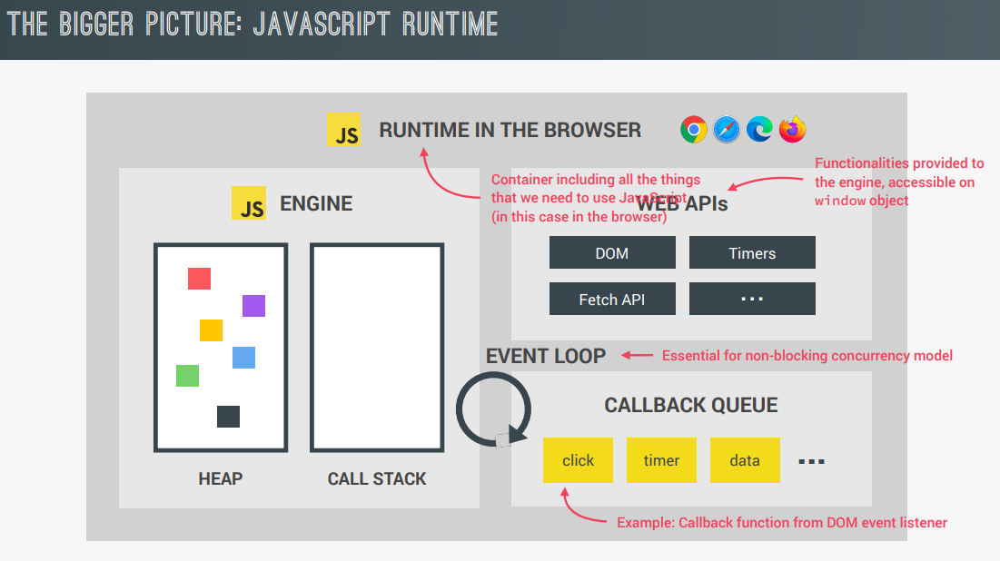
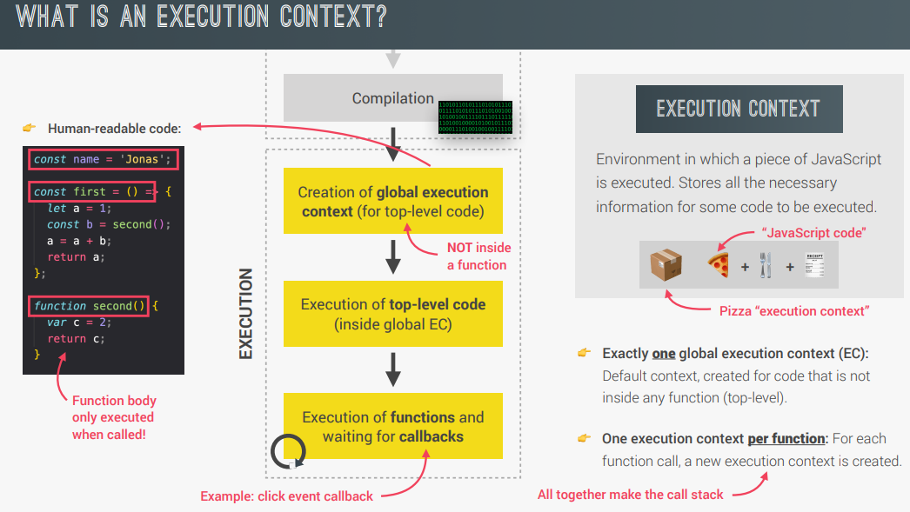
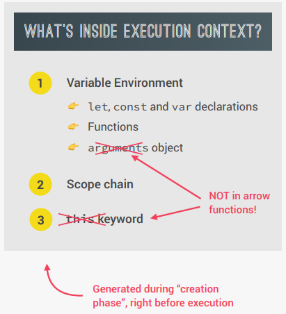
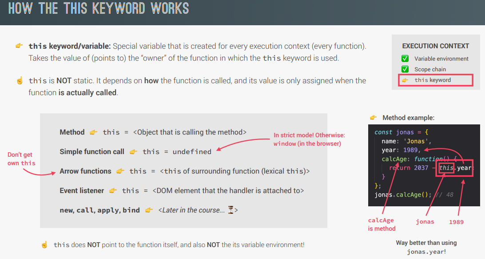
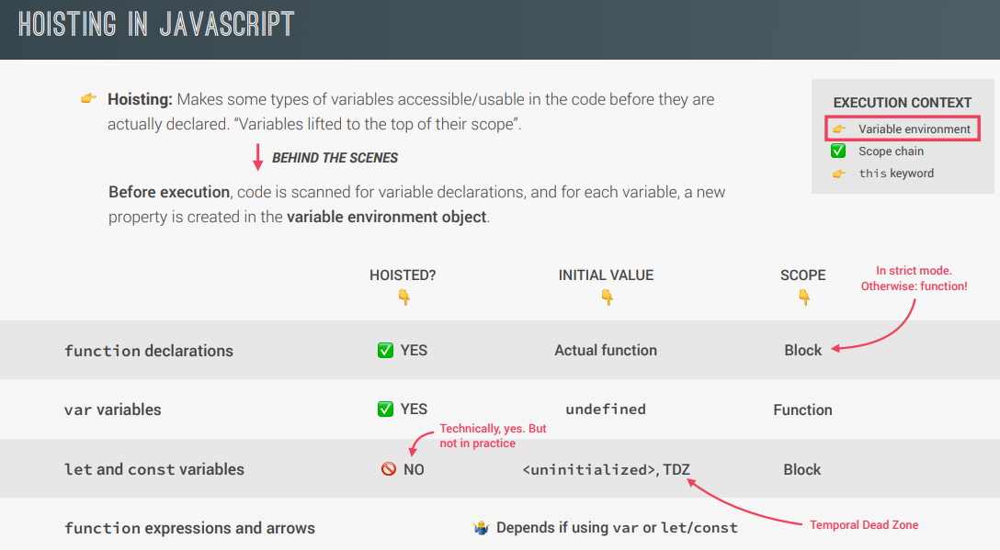
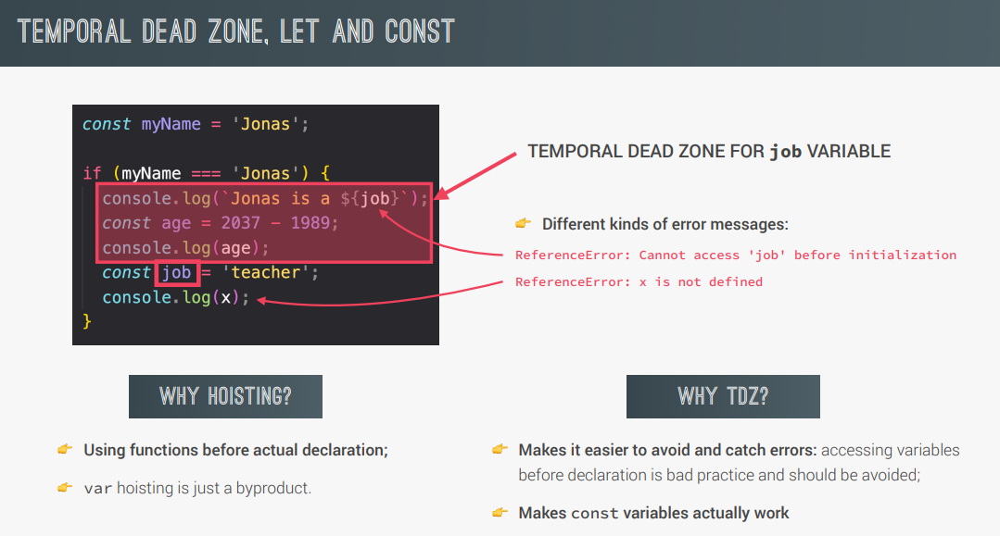

### Concurrency model

- JavaScript runs in _one single thread_, so it can only do one thing at a time.
  We handle concurrent tasks by using an event loop: takes long running tasks, executes them in the “background”(web API), and puts them back in the main thread once they are finished.

  Event loop is the one which decides when each callback will be taken out of callback queue & executed in the call stack.
  

  Event Loop In Practice
  (here setTimeout should be called first as it was put in queue first, but microtask queue of promises callback has priority over normal callback queue)
  

### Is JS an interpreted language?

- Not really! JS is a JIT(just-in-time) compiled language.
  In modern browsers, JS code is compiled and executed immediately, instead of line-by-line interpretation.
  JS engines(they have 'call-stack': to execute code & 'heap': to store objects in memory) like V8(chrome) compile & execute a bare bones version of our code, while optimizing it in background threads. This optimized code replaces the previous code.
  

### What is a JS runtime?

### What is an execution context?

3 parts of execution context: Variable Environment, Scope Chain, 'this' Keyword

Call Stack: place where execution contexts are stacked on top of each other

### 'this' Keyword?

### What is TDZ & Hoisting?

If we try to access variables defined with 'var' before defining them, our code would execute and we would get 'undefined' as result. But if we use ES6's let/const, then we will get a reference error!
Variables defined with 'var' are attached to the window object.

Similarly, we can use only Function Declaration(function add(1,2)) before defining it. Other methods like Funtion Expression (var add = function(a,b)) or Arrow Functions will throw error!

### Primitive Vs Reference Values (like pointers in C++)

It is a misconception that all values declared with 'const' are immutable. This is true only for primitive values(stored in stack), we can mutate reference values(stored in heap; eg: objects, arrays, fns, etc)
