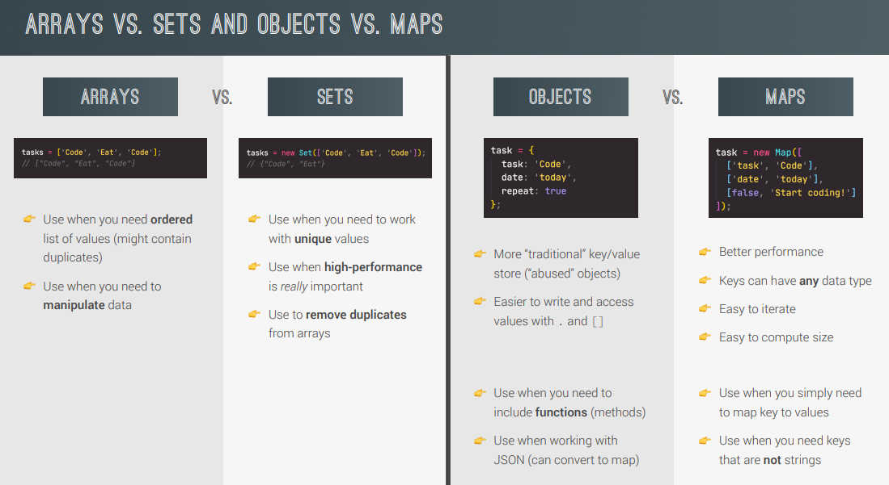

### Destructuring

- main use case is storing data fetched from API calls
- property names on left side need to exactly same as present in original object

### Spread (used where we have values separated by a ',')

- for getting elements of an array separately

- _Spread is on right side of =_
  const arr = [1, 2, ...[3,4]]
  arr = [1, 2, 3, 4]

- use cases:

  1. shallow copy of array
  2. merge 2 arrays

  ### Rest (used where we have variable names separated by a ',')

- for packing elements into an array

- _Rest is on left side of =_
  const [a, b, ...others] = [1, 2, 3, 4]
  others = [3,4]

### Which Data Structure to choose?

