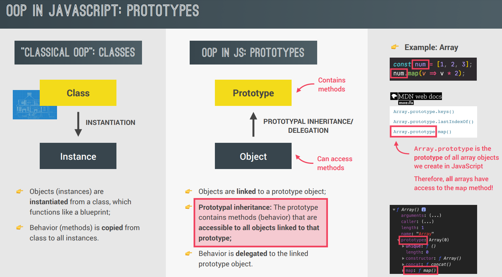

### what is OOP?

A programming paradigm based on the concept of objects. These objects have some data(variables) and behaviour(funtions) stored inside them and act as a small application on their own(self-contained code). We use APIs(public interface) to interact with these objects outside of their scope.
OOP's main purpose: organizing code to make it clean and maintainable

### 4 priniciples of OOP

1. ABSTRACTION: hiding the behind-the-scenes details which are not relevant for implementation. Ex: addEventListener()
2. ENCAPSULATION: keeping methods and ppts private inside the class to prevent manipulation from outside
3. INHERITANCE: child-parent class relationship to reuse common logic
4. POLYMORPHISM: a child can overwrite the method it inherited from parent

### OOP in JavaScript!

#### Funtion constuctors

We should never write fns inside fn constructors as all the instances/objects created with 'new' keyword will inherit these methods, even if they are not required for that particular instance.

Instead, we use Prototype to do this.

#### Prototype Inheritance and chain

Each object in JS has a prototype property (top of chain has object.prototype set as 'null').
JS Engine keeps looking-up in the prototype chain for methods which are defined.

In above example, (jonas.**proto**.**proto**.**proto**) === null; //true

Example of Arrays:

By accessing Array.prototype, we can modify/add a fn inside original Array object. Now, all the array objects created can use this. But this is _not a good practice_ in general.

#### ES6 Classes

They are just syntactical sugar on top of prototypes

Basically classes are special type of funtions(note: fns are hoisted, classes are not) behind the scenes.
First-class citizens means classes can be passed through other fns

#### Getters & Setters

#### Static Methods

These are not attached to object's prototype property, rather attached directly to the object.
For example: _*Array.from();*_, here we can't do [1,2,3].from() as .from is not available to instances of array but only to Array object itself

#### Object.create

#### Inheritance in Classes

_Using Constructor Funtions_

Using ES6 Classes(syntactical sugar; under the hood works same as constr. fn)

#### Encapsulation: Private Class Fields and Methods

### CLASSES SUMMARY

